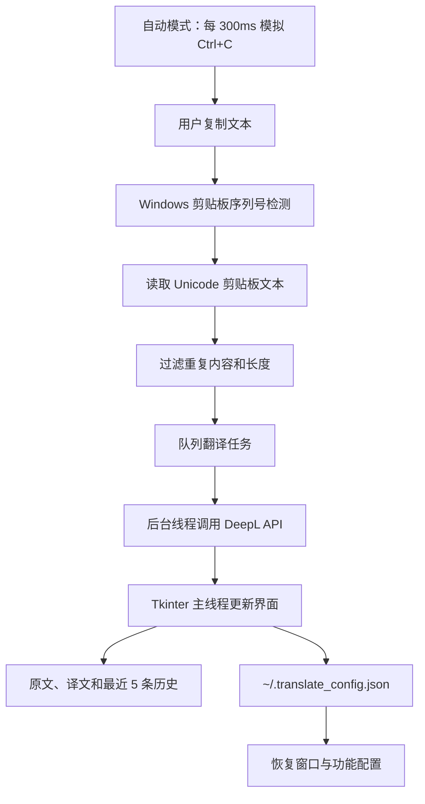

# Clipboard Translate 开发者指南

## 一句话概述

`Clipboard Translate` 是一个基于 Python 标准库、Tkinter 和 Windows Win32 API 构建的桌面划词翻译工具，通过监听剪贴板变化或模拟 `Ctrl+C` 获取选中文本，再调用 DeepL API 返回中文译文。

## 1. 背景与解决的问题

阅读英文文档、代码和网页时，频繁切换浏览器翻译工具会打断工作流。本项目提供一个常驻桌面窗口：

- 复制文本后自动翻译；
- 开启“自动”模式后，选中文字即可触发复制和翻译；
- 原文、译文和最近历史记录集中显示；
- 窗口可以置顶，方便与其他应用并排使用；
- 窗口尺寸、分割线位置和功能开关可以持久化。

项目定位是轻量级 Windows 桌面工具，不包含服务端，不保存服务端数据库，也不提供多用户账号体系。

## 2. 技术栈与运行特征

- Python 3.8+
- Tkinter / `ttk`：桌面 GUI 和控件布局
- `ctypes`：调用 Windows 用户32和内核32 API
- `urllib.request`：调用 DeepL HTTP API
- `threading`：在后台线程执行网络翻译，避免阻塞 GUI
- `json`：请求、响应和本地配置的序列化
- Windows：依赖 `user32.dll`、`kernel32.dll` 和 Windows 剪贴板 API

项目没有第三方 Python 依赖，不需要 `pip install` 或构建步骤。

## 3. 整体架构



核心原则是：网络请求不在 Tkinter 主线程中执行；所有控件更新通过 `root.after()` 回到 GUI 线程完成。

## 4. 文件结构

```text
translate/
├── translate_gui.py             # 唯一应用入口和主要实现
├── translate-developer-guide.md # 本开发者指南
├── README.md                    # 用户使用说明
├── LICENSE                      # MIT 许可证
└── .gitignore                   # 忽略缓存、构建文件和本地配置
```

## 5. 核心模块与函数

### 5.1 Windows 剪贴板层

#### `send_ctrl_c()`

使用 `user32.keybd_event` 模拟按下和释放 `Ctrl+C`。该函数是“选中即复制”模式的基础。

- 参数：无。
- 返回值：无。
- 副作用：向当前前台窗口发送键盘事件，可能触发目标应用的复制行为。
- 注意：该函数依赖 Windows 前台窗口和目标应用对 `Ctrl+C` 的支持。

#### `read_clipboard(root=None)`

优先通过 Win32 API 读取 `CF_UNICODETEXT`，失败后尝试使用 Tkinter 的 `clipboard_get()` 兜底。

- 参数：可选的 Tkinter 根窗口，用于兜底读取。
- 返回值：去除首尾空白的字符串；没有可读文本时返回空字符串。
- 副作用：打开并读取系统剪贴板，但最终会关闭剪贴板句柄。
- 异常处理：底层读取失败时通常返回空字符串，不向调用方抛出异常。

### 5.2 配置层

#### `load_config()` / `save_config(config)`

配置文件路径由以下常量确定：

```python
CONFIG_FILE = os.path.join(os.path.expanduser("~"), ".translate_config.json")
```

当前保存的字段包括：

| 字段 | 类型 | 作用 |
| --- | --- | --- |
| `window_geometry` | string | Tkinter 窗口尺寸和位置，例如 `400x500+100+100` |
| `sash_pos` | list[int] | 原文、译文、历史面板之间的分割线位置 |
| `auto_copy` | boolean | 是否启用选中即复制模式 |
| `deepl_key` | string | DeepL Auth Key |
| `history_visible` | boolean | 历史面板状态；当前实现会固定保存为显示状态 |

读取配置失败、文件不存在或 JSON 损坏时，`load_config()` 返回空字典。保存失败时 `save_config()` 会静默忽略 `OSError`。

安全注意：DeepL Auth Key 当前保存在用户目录下的 JSON 文件中。该文件不会提交到 Git，但在共享电脑上仍应限制文件访问权限，或改为使用 Windows Credential Manager 等安全存储方案。

### 5.3 `TranslateWindow`

`TranslateWindow` 是应用的主控制器，负责创建窗口、初始化状态、绑定事件、调度剪贴板检测、调用 API 和更新界面。

主要初始化状态包括：

- `last_seq`：最近一次 Windows 剪贴板序列号。
- `last_text`：最近处理过的文本，避免相同内容重复翻译。
- `translating`：当前是否存在翻译任务。
- `pending_text`：当前任务执行期间保留的最新待处理文本。
- `history`：内存中的最近 5 条 `(原文, 译文)` 对。
- `auto_copy`：是否开启自动复制。
- `closing`：窗口关闭后阻止定时器和后台回调继续更新界面。

#### GUI 初始化

- `setup_style()`：配置 Tk/ttk 控件的主题、背景色和按钮样式。
- `setup_gui()`：创建工具栏、原文区、译文区、历史面板和状态栏。
- `setup_context_menu()`：创建右键菜单并绑定右键事件。

界面使用垂直 `ttk.PanedWindow` 管理三个面板：原文、译文和历史记录。历史面板可以通过按钮或右键菜单显示/隐藏。

#### 配置恢复与保存

- `apply_config()`：读取窗口几何尺寸、DeepL Key 和分割线配置。
- `_apply_delayed()`：窗口显示约 300ms 后恢复分割线和自动复制状态。
- `_valid_sash_positions()`：过滤无效的分割线位置。
- `on_window_resize()`：窗口尺寸变化时启动 500ms 防抖保存。
- `_do_save_config()`：保存当前窗口、分割线、自动复制和 API Key 配置。
- `_periodic_save()`：每 3 秒保存一次，主要用于捕获分割线拖动。

#### 功能操作

- `clear_panel()`：清空原文和译文文本框。
- `toggle_topmost()`：切换窗口的 `-topmost` 属性。
- `toggle_auto_copy()`：切换自动复制模式并启动或停止 300ms 定时循环。
- `_auto_copy_loop()`：调用 `send_ctrl_c()`，然后通过 `root.after(300, ...)` 继续轮询。
- `toggle_history()`：显示或隐藏历史面板，并恢复分割线位置。
- `refresh_history()`：重新渲染最近翻译记录。
- `restore_from_history(orig, trans)`：将历史记录恢复到原文和译文面板。
- `copy_to_clipboard(text)`：把译文写入系统剪贴板。

### 5.4 剪贴板监听与任务调度

#### `monitor_clipboard()`

每 50ms 检查一次 `GetClipboardSequenceNumber()`。当序列号变化时，读取文本并执行以下过滤：

```python
if text and text != self.last_text and len(text) > 0 and len(text) < 5000:
    self.queue_translate(text)
```

因此，空文本、重复文本以及长度达到 5000 个字符或以上的文本不会进入翻译流程。

#### `queue_translate(text)`

使用 `translation_lock` 保证任务状态一致：

- 没有进行中的任务：设置 `translating=True`，启动一个 daemon 后台线程。
- 已有任务：只保留最新的 `pending_text`，避免连续复制造成无限任务堆积。

这种策略是“单任务执行 + 最新值覆盖”的轻量队列，而不是完整的 FIFO 队列。

#### `do_translate(text)`

在后台线程中调用 `_call_api()`。成功时使用 `_safe_after()` 将界面更新切回 Tkinter 主线程；失败时显示错误信息。任务结束后，如果存在最新待处理文本，则继续处理它。

#### `_safe_after(callback, *args)`

在窗口未关闭时调用 `root.after(0, ...)`，避免后台线程直接修改 Tkinter 控件。窗口关闭期间会跳过回调，降低 `TclError` 风险。

### 5.5 DeepL API

#### `_call_api(text)`

请求地址：

```text
https://api-free.deepl.com/v2/translate
```

请求使用 JSON body 和 `DeepL-Auth-Key` 请求头：

```python
{
    "text": [text],
    "target_lang": "ZH"
}
```

- 输入：待翻译字符串。
- 返回：`translations[0]["text"]` 中的译文字符串。
- 超时：10 秒。
- HTTP 错误：转换为包含状态码的 `RuntimeError`。
- 网络错误：区分超时和普通连接失败。
- JSON 错误：提示返回内容不是有效 JSON。
- 结构错误：提示响应中没有找到译文。
- 副作用：产生一次 DeepL API 请求和相应的第三方服务费用。

当前实现固定将目标语言设为 `ZH`，没有暴露源语言、目标语言、术语库或模型选择配置。

### 5.6 应用生命周期

- `run()`：进入 `root.mainloop()`，启动 Tkinter 事件循环。
- `on_close()`：设置关闭标志、停止自动复制、取消尺寸保存定时器、保存配置并销毁窗口。

入口代码：

```python
if __name__ == "__main__":
    app = TranslateWindow()
    app.run()
```

## 6. 快速开始

### 6.1 启动

在项目目录执行：

```powershell
cd "C:\Users\mayikang\Desktop\translate"
python translate_gui.py
```

项目只使用 Python 标准库，不需要额外安装第三方包。必须在 Windows 环境运行，因为代码直接加载 Win32 DLL。

### 6.2 配置 DeepL

1. 启动程序。
2. 右键窗口，选择“DeepL 设置”。
3. 输入 DeepL Auth Key。
4. 点击“保存”。
5. 复制一段文本，观察译文面板。

也可以通过程序界面后续修改配置；不建议把 Key 写入源码或提交到仓库。

### 6.3 使用自动模式

点击工具栏“自动”按钮后，程序每 300ms 向当前前台窗口发送一次 `Ctrl+C`。在其他应用中选中文字后，文本会进入剪贴板监听流程。

该模式适合普通文本编辑器、浏览器和文档应用；如果目标应用拦截模拟按键、使用自定义渲染文本或存在权限隔离，可能无法读取选中文本。

## 7. 异常、并发与数据边界

### 网络异常

DeepL 请求可能遇到 HTTP 错误、DNS/连接失败、超时或非法 JSON。程序会把这些异常转换为状态栏消息，不会自动重试。

不自动重试是为了避免用户无感知地重复产生 API 请求和费用。若后续增加重试，应只针对明确可重试的网络错误，并加入次数、退避时间和取消机制。

### 并发策略

- API 请求在 daemon 线程执行。
- 同时最多执行一个翻译任务。
- 翻译期间只保留最后一次新文本。
- GUI 控件只允许 Tkinter 主线程更新。

### 历史记录边界

历史记录只保存在内存中，最多保留 5 条，应用退出后不会恢复。配置文件中的 `history_visible` 只保存面板显示状态，不保存历史正文。

### 文本边界

剪贴板监听会忽略长度达到 5000 字符或以上的文本。该限制保护响应速度和 API 使用成本，但目前没有在界面上明确提示“文本过长被忽略”。

## 8. 验证与调试建议

基础语法检查：

```powershell
python -m py_compile translate_gui.py
```

建议人工验证以下场景：

1. 未配置 Key 时复制文本，状态栏应提示配置 DeepL Auth Key。
2. 配置有效 Key 后复制英文文本，原文和译文应分别显示。
3. 连续快速复制多段文本，最终应优先处理最新一段。
4. 复制相同文本两次，第二次不应重复触发翻译。
5. 开启“自动”模式，在浏览器或编辑器中选中文字，检查是否能自动翻译。
6. 切换历史面板，点击历史记录恢复内容或复制译文。
7. 调整窗口大小和分割线，重启后检查配置是否恢复。
8. 在翻译进行中关闭窗口，确认不会继续更新已销毁的控件。
9. 使用错误 Key、断网和超时场景，检查状态栏错误是否清晰。

## 9. 兼容性与安全注意事项

- 仅支持 Windows；在 macOS/Linux 上会因 `ctypes.windll` 不存在而无法启动。
- 目标应用与本程序权限级别不一致时，模拟 `Ctrl+C` 可能不起作用。
- DeepL Auth Key 保存在本地 JSON 中，属于敏感配置，不得提交到 Git 或公开截图。
- 复制的文本会发送至 DeepL API，处理敏感文本前应确认隐私和合规要求。
- `history` 保存在内存中，但界面可能显示已复制的敏感内容；使用共享电脑时应及时清空或退出。
- 当前没有托盘图标、开机自启、系统级全局热键和持久化历史数据库。

## 10. 可扩展方向

- 将 DeepL 调用抽象为翻译引擎接口，支持其他服务或本地模型。
- 增加目标语言选择、源语言选择和请求取消。
- 为 API 请求增加可控重试、指数退避和速率限制。
- 使用 Windows Credential Manager 保存 Auth Key，避免明文 JSON。
- 将历史记录持久化为 SQLite，并增加搜索和删除功能。
- 为剪贴板监听、队列调度、响应解析和配置校验补充自动化测试。
- 将 Windows 专有逻辑隔离到平台适配层，为其他系统提供兼容实现。

## 11. 版本与维护信息

- 项目入口：`translate_gui.py`
- 当前项目类型：Windows 本地桌面 GUI 工具
- 许可证：MIT
- 当前翻译目标语言：中文 `ZH`
- 当前历史记录上限：5 条
- 当前剪贴板文本上限：小于 5000 字符
- 当前 API 超时时间：10 秒
- 当前轮询间隔：剪贴板 50ms；自动复制 300ms；配置周期保存 3 秒

维护代码时，优先保持以下边界：后台线程不能直接操作 Tkinter 控件；API Key 不进入日志和源码；定时器在窗口关闭时必须停止；任何新的 API 重试都要考虑重复扣费风险。

